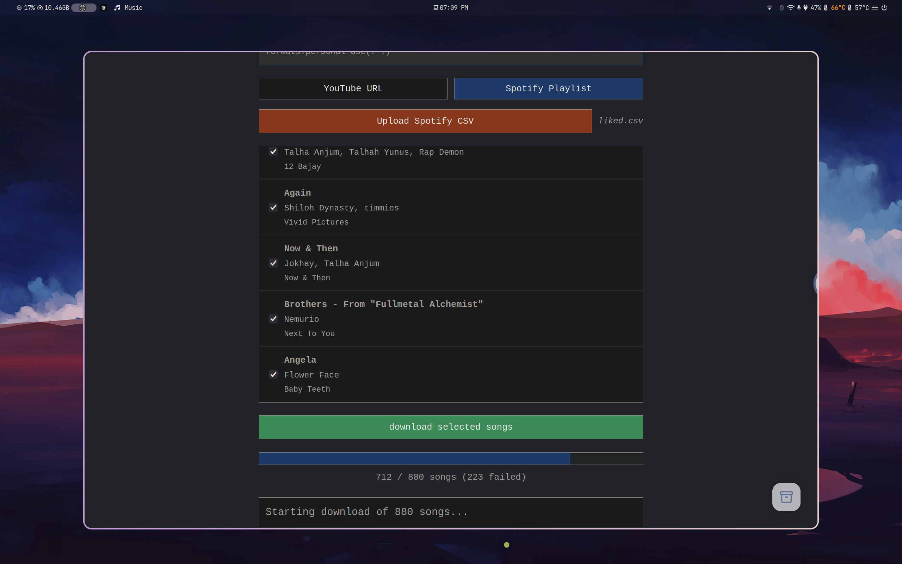

# AV-Yoink

A lightweight web application for downloading audio and video from YouTube URLs and Spotify playlists. Built with a minimal Node.js/Express backend using `yt-dlp` and a clean, vanilla JavaScript frontend for a simple, efficient user experience.



## Features

- **YouTube Downloads**: Extract audio (MP3) or video in multiple resolutions
- **Spotify Bulk Downloads**: Batch download entire playlists as MP3s from CSV export
- **Smart Metadata**: Automatically embeds thumbnails, titles, and artist info
- **Bot Detection Bypass**: Uses `cookies.txt` to avoid YouTube restrictions
- **Drag Selection**: Quick multi-select for playlist songs
- **Concurrent Downloads**: Downloads 5 songs simultaneously for faster batch processing
- **Clean UI**: Video previews, quality selection, and intuitive playlist management

## Prerequisites

- **Node.js**: v18 or higher
- **Docker** (optional): For containerized deployment
- **Python 3** and `pip`: For `yt-dlp`
- **FFmpeg**: For audio/video processing and metadata embedding
- **Spotify CSV**: Export via [Exportify](https://github.com/watsonbox/exportify)
- **YouTube Cookies** (recommended): For bot detection bypass (see [Managing Cookies](#managing-cookies))

## Installation

### Option 1: Local Development

1. **Clone the Repository**:
   ```bash
   git clone https://github.com/ftbhabuk/av-yoink.git
   cd av-yoink
   ```

2. **Install Dependencies**:
   ```bash
   # Arch Linux
   sudo pacman -S nodejs npm python python-pip ffmpeg
   
   # Install yt-dlp
   pip install yt-dlp
   
   # Install Node packages
   npm install
   ```

3. **Add YouTube Cookies** (Recommended):
   - Copy `cookies.txt.example` to `cookies.txt` and populate with valid cookies
   - See [Managing Cookies](#managing-cookies) for detailed instructions

4. **Run the Application**:
   ```bash
   node server.js
   ```
   - Access at `http://localhost:5000`

### Option 2: Docker Deployment

1. **Clone and Build**:
   ```bash
   git clone https://github.com/ftbhabuk/av-yoink.git
   cd av-yoink
   docker build -t av-yoink .
   ```

2. **Run with Cookies** (Recommended):
   ```bash
   docker run -p 10000:10000 -v $(pwd)/cookies.txt:/etc/secrets/cookies.txt av-yoink
   ```

3. **Run without Cookies**:
   ```bash
   docker run -p 10000:10000 av-yoink
   ```
   - Access at `http://localhost:10000`

## Usage

### YouTube Mode

1. Paste a YouTube URL into the input field
2. Preview automatically loads with thumbnail and video info
3. For video downloads: Select quality from dropdown
4. Click **Download Audio** (MP3) or **Download Video**

### Spotify Mode

1. Export your Spotify playlist as CSV using [Exportify](https://github.com/watsonbox/exportify)
2. Click **Upload CSV** and select your file
3. Songs appear in a list - drag to select multiple or use Select All
4. Click **Download Selected Songs**
5. Files download individually (no ZIP) with progress tracking

**Note**: Downloads process 2 songs concurrently. A 5-15% failure rate is normal due to songs not being found on YouTube, regional restrictions, or name mismatches.

## Managing Cookies

YouTube frequently blocks automated requests. Using cookies significantly improves success rates.

### Getting Your Cookies

1. **Log into YouTube** in your browser and complete any CAPTCHA/verification
2. **Export cookies** using a browser extension:
   - **Firefox**: [cookies.txt](https://addons.mozilla.org/en-US/firefox/addon/cookies-txt/)
   - **Chrome**: [Get cookies.txt](https://chrome.google.com/webstore/detail/get-cookiestxt/bgaddhkoddajcdgocldbbfleckgcbcid)
3. **Save as `cookies.txt`** in project root (local) or mount to `/etc/secrets/cookies.txt` (Docker)

### Important Cookie Fields

Ensure your `cookies.txt` includes these YouTube domains:
- `__Secure-3PSID`
- `SID`
- `HSID`
- `SSID`

**Maintenance**: Cookies expire frequently (days to weeks). Update regularly if downloads start failing.

## Troubleshooting

| Issue | Solution |
|-------|----------|
| "Download failed" errors | Update `cookies.txt` or check if video is age-restricted/geo-blocked |
| Slow Spotify downloads | Normal - each song takes 10-20s to search and download |
| Songs not found | Try different search terms or download manually - some songs aren't on YouTube |
| Bot detection | Refresh your `cookies.txt` file |
| FFmpeg errors | Ensure FFmpeg is installed and in PATH |

## Technical Details

- **Concurrent Processing**: Downloads 2 songs simultaneously to balance speed and stability
- **Metadata Embedding**: Uses FFmpeg to embed album art and ID3 tags
- **Timeout Protection**: 60s timeout per song to prevent hanging
- **Automatic Cleanup**: Temporary files deleted after download
- **Rate Limit Friendly**: Controlled request pacing to avoid YouTube blocks

## Dependencies

### Backend
- `express` - Web server
- `cors` - Cross-origin support
- `multer` - File upload handling
- `csv-parser` - Spotify CSV parsing
- `p-limit` - Concurrency control
- `uuid` - Unique file naming
- `yt-dlp` - Video/audio extraction
- `ffmpeg` - Media processing

### Frontend
- Vanilla JavaScript (no frameworks)
- Modern ES6+ features
- Responsive CSS

## Notes

- **Personal Use**: This tool is designed for personal archival and educational purposes
- **Terms of Service**: Respect YouTube and Spotify ToS - download only content you have rights to
- **Legal Notice**: Downloading copyrighted content without permission may violate local laws
- **No Warranty**: Provided as-is without guarantees of availability or functionality

## License

MIT License. See `LICENSE` file for details.

## Contributing

Contributions welcome! Please open an issue or PR for bugs, features, or improvements.

---

**Maintained by**: [@ftbhabuk](https://github.com/ftbhabuk)